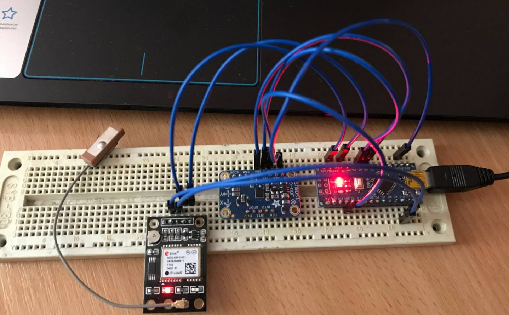

# Insomnia-Arduino-union-GPS-and-Giroscope

## GPS module which i use:

## The module I use to determine the accelerometer, magnetometer and gyroscope data:

## Prototype view:

## Description
I connected an arduino nano module and adafruit lsdsm1 to the i2c protocol. At the moment, this is just a layout implemented on a Bradboard. In the future it is planned to connect GSM module and create a full-fledged prototype.
